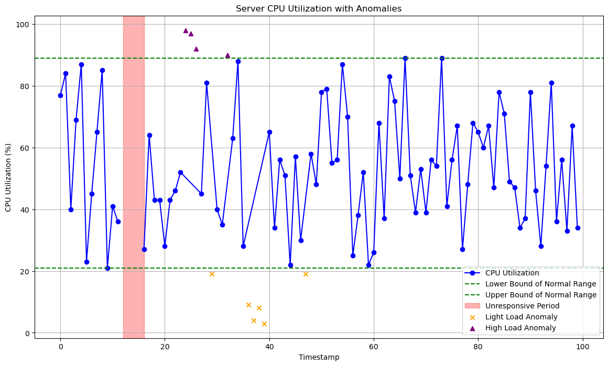

# Server CPU Utilization Monitoring and Anomaly Detection

This repository contains Python code to detect anomalies in server performance data, such as CPU utilization, using the Isolation Forest algorithm. The project can be used to analyze and visualize server load conditions, identifying anomalies like light loads, high loads, and unresponsive periods.

## Features

- **Isolation Forest Range Detection**: Identifies the normal operating range of a feature based on an Isolation Forest model.
- **Server Monitoring**: Monitors the server performance and detects periods of light load, high load, and unresponsive states.
- **Visualization**: Plots the normal range, anomalies, and unresponsive periods for easy analysis.

